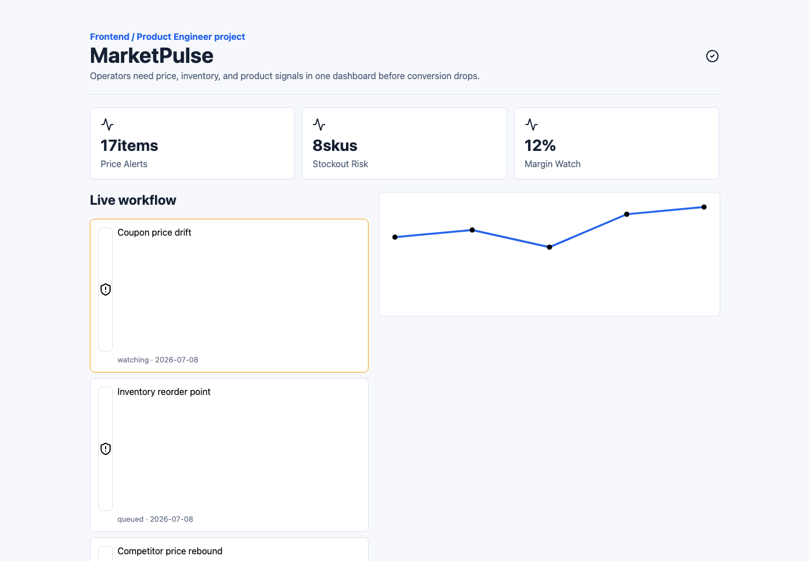

# MarketPulse Workspace


상품 가격, 재고, 이벤트 신호를 한 화면에서 확인하고 운영 우선순위를 정할 수 있도록 만든 커머스 운영 대시보드 프로젝트입니다.

## 저장소 구성

- FE: [`marketpulse-fe`](https://github.com/marketpulse-labs/marketpulse-fe)
- BE: [`marketpulse-be`](https://github.com/marketpulse-labs/marketpulse-be)
- 개인 공개 미러: https://github.com/cyjoon68/marketpulse-workspace
- 기본 브랜치: `develop`

## 핵심 기능

- 가격 변동 알림과 재고 위험 신호 확인
- 상품 이벤트 기반 운영 우선순위 표시
- D3 기반 가격/재고 추세 시각화
- REST API 기반 dashboard/event 상태 조회
- PostgreSQL 기반 상품 snapshot 데이터 관리

## 화면



## 기술 스택

- Frontend: React, TypeScript, ky, TanStack Query, D3, jQuery
- Backend: Python, Flask, Tortoise ORM
- Database: PostgreSQL
- Infra/Test: Docker Compose, OpenAPI, pytest, k6, Playwright

## 실행

```bash
git submodule update --init --recursive

cd marketpulse-fe
npm install
npm run dev

cd ../marketpulse-be
python3 -m venv .venv
. .venv/bin/activate
pip install -r requirements.txt
pytest
```

## 데이터 흐름

```text
Product Dashboard
  -> ky client
  -> Flask REST API
  -> Tortoise ORM
  -> PostgreSQL
```
